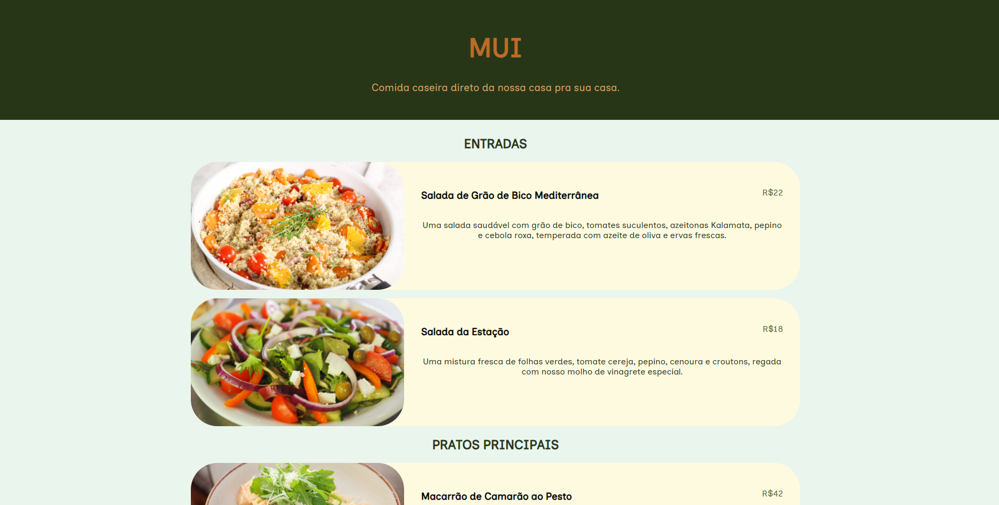

# Cardápio do Restaurante MUI 🍔🍕

Bem-vindo ao nosso restaurante virtual! Aqui no "MUI", nossa especialidade é servir tecnologia e design deliciosos em um prato. 😄

## 🍽️ Sobre

Este repositório foi criado como parte do programa "Elas na Tech", onde mergulhamos de cabeça no mundo da programação e design web. Nossa missão? Simular um cardápio de restaurante usando HTML e CSS!

Confira [aqui](https://germanavaz.github.io/cardapio/)!

## 🚀 Tecnologias Utilizadas

- HTML
- CSS

## 🍔 Nosso Cardápio

Confira nosso incrível cardápio:

- **Hamburguer HTML:** Um clássico recheado com estrutura semântica e tags poderosas.
- **Pizza CSS:** Uma deliciosa pizza crocante com estilização de dar água na boca.
- **Sobremesa de Responsividade:** Não deixe de experimentar nossa sobremesa especial, que se adapta a qualquer tela!

## 🤝 Contribuição

Você está convidado a contribuir com nosso cardápio! Sinta-se à vontade para adicionar novos pratos (ou recursos) e enviar um pull request. Vamos criar juntos um cardápio de dar água na boca!

## 🍦 Sobremesa

Obrigado por visitar o "MUI". Esperamos que você tenha se divertido explorando nosso cardápio. Bom apetite! 🍰✨
